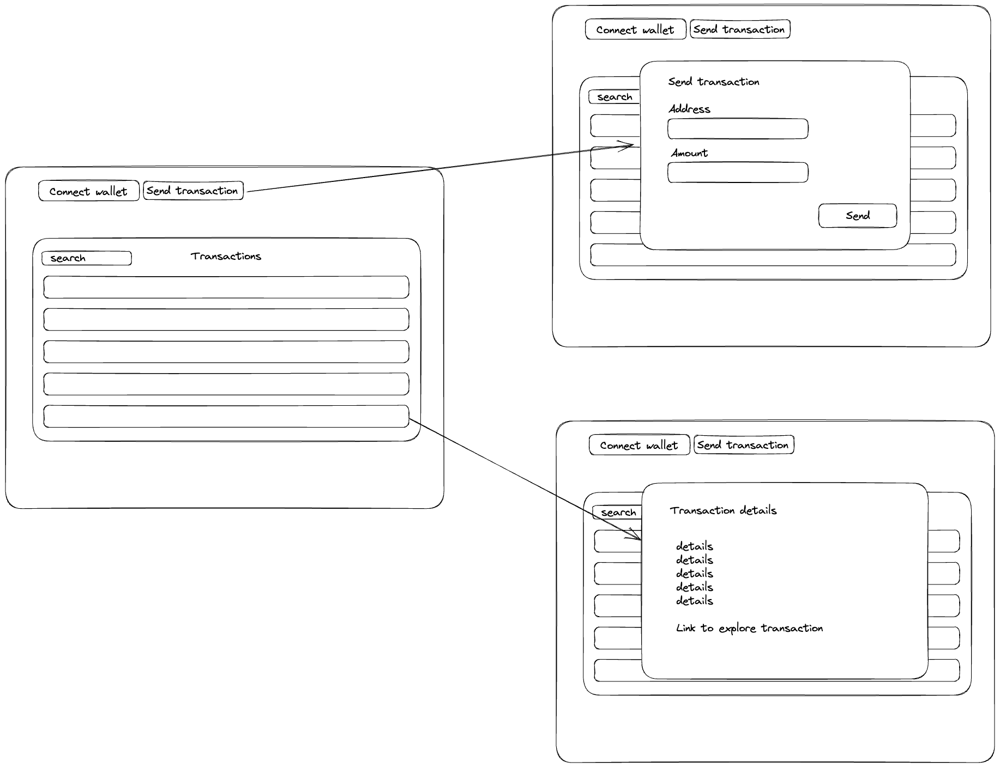

This is a [Next.js](https://nextjs.org/) project bootstrapped with [`create-next-app`](https://github.com/vercel/next.js/tree/canary/packages/create-next-app).

## Getting Started

First, run the development server:

```bash
npm run dev
```

Open [http://localhost:3000](http://localhost:3000) with your browser to see the result.

Rough design to follow:


## Engineering considerations:
### NextJS + Vercel + Supabase
Decided to use these 3 technologies for ease of deployment as the requirements as stated required a FE, a BE and DB to do it properly.

### Why NextJS?
- React was a given
- Would benefit from having a serverless BE to help process requests to DB and to Solana blockchain
  - Ended up putting transaction creation logic in the FE code anyway for the sake of time
- modern React framework comes with a lot of features including SSR, routing, and developer ease of use that aren't really highlighted by the app as is

### Why Vercel?
- Vercel is native for NextJS -- again, ease of use

### Why Supabase + Prisma?
- Developer familiarity... that's like really the only reason why

### Why Redux, MUI, Fuse, etc.?
- Uhh, again developer familiarity... so you get the theme
- Generally, well documented and simple enough to learn it quickly and implement it

## Timeline

I was aiming to get some sort of working set of features done as quickly as possible and then iterate on it, adding Redux and MUI. The basic features I aimed for:
- Connecting / disconnecting wallet
- Sending Sol
- Autocomplete with suggestions (not yet plugged into search)
- Tabular layout of transactions pulled from DB (not state)

Features on next iteration:
- Modals for sending Sol, transaction details
- Snackbar for success
- Loading spinners
- Fuse search on table
- Redux store rerendering table after sending Sol (helps relieve the Sol sending component from needing to directly trigger a rerender on the table)

## Improvements:
- Redux store is storing a flat list of transaction details which works but is not optimized for speed or connectivity
  - Can move towards treating the store as a local cache of transactions and have updates to DB reach eventual consistency (e.g. write-behind cache) to optimize for client performance
  - Can move towards the store just keeping track of transaction IDs and asking for specific transaction in a follow-up requests to populate table (more scalable approach to handling transactions app-wide)
- UI / UX
  - Utilizing theme, colors, etc.
  - More clear interaction with modals, x-buttons to close, closing after transaction is complete, etc.
  - Laying out the UI more with Stacks (flexbox), Boxes, etc.
  - Can aim for a more sleek UX with asking for Wallet connection before showing the rest of the UI (full page modal or redirect), better transitions with what happens when wallet disconnects, etc.


